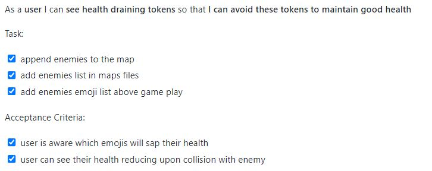
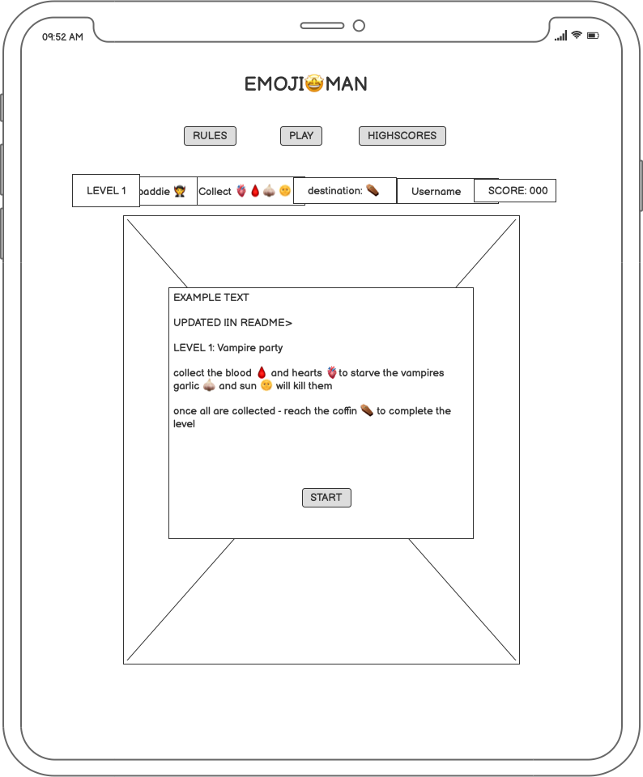
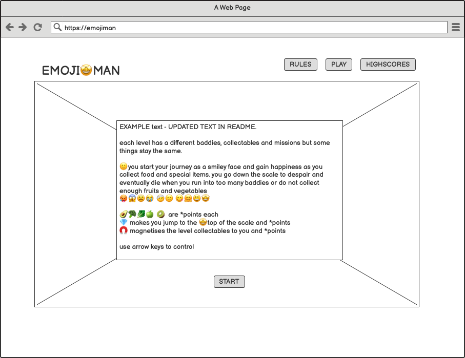
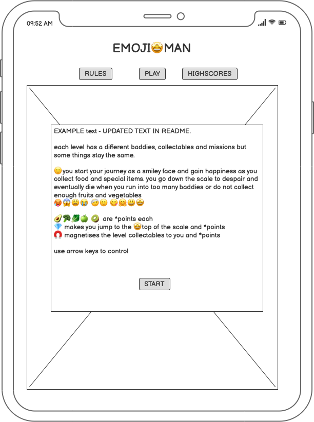
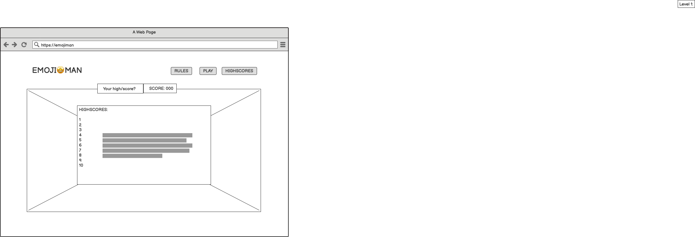
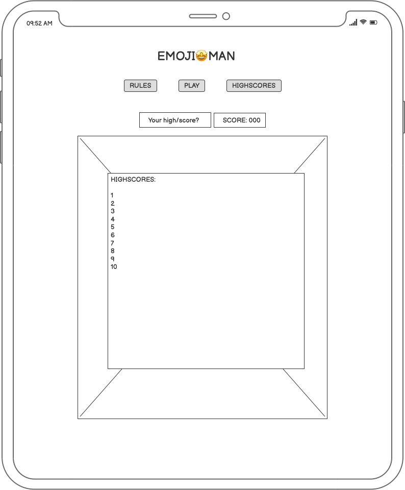

# Emoji-man 😀

## Project Overview
- This website was developed for the Code Institute July 2022 'World Emoji Day' Hackathon (13th - 18th July)
- The website is deployed using Github pages at the following url: https://seanyoung247.github.io/emoji-man/
- The repository on Github that contains the website source code and assets is available at the following url: https://github.com/seanyoung247/emoji-man 
- The website was built with a responsive look and feel, designed to be enjoyable to use on all screen sizes. 

### Contributors
- [Sean Young](https://github.com/seanyoung247)
- [Lucy Colley](https://github.com/MojosBeans100)
- [Kamil Kwiatkowski](https://github.com/kamil-kw)
- [Andy Guttridge](https://github.com/andy-guttridge)
- [Rachel O'Donnell](https://github.com/rachel-o-donnell)
- [Yasir](https://github.com/yasirwiifto)
- [Keegan Waters](https://github.com/Keeganw3)

## Rules
Help Emojiman become the happiest emoji by thwarting the evil plans of the baddies in Emojiland.
Each level Emojiman encounters a new baddie to defeat, he must collect all the special items and then reach a special destination point to reach the next level.

### HEALTH SCALE:       
                    	despair 🥵😱😩😭🤕 🙂 😋🤗😃🤩 ultimate happiness

You start off as 🙂 a happy emoji but Emojiman transforms up and down the scale of happiness depending on what or who he bumps into. Avoid all the baddies of Emojiland, collect all the fruit and veg and to keep your happiness at a peak ecstatic.

Emojiman will start a next level in the condition he was in when he reached his destination in the last l - so keep eating those greens!

### WIN POINTS AND GAIN HAPPINESS!
Collect points to be a part of the highest scores leaderboard. The top ten scores are published on the leaderboard page.

### FOOD:

🥑🥦🥬🍏 🥝  	10 points each
				Each fruit or veg gains you 1 position on the happiness scale

🍒  				30 points 
				Gain 1 position on the happiness scale

### BADDIES:

🧟🧛👽🦁🐯
🐻☠️🏴‍☠️🤡🤹‍♂️     Each baddie you cross paths with moves you down 1 place the scale of happiness. 
🃏😈🔥👾🤖

### LIMITED TIME BONUS OR BOOS:
These special icons will occasionally appear in the game, and only for a brief amount of time so grab them while you can!

💎	50 points 
	When the diamond is collected Emojiman immediately transforms into 🤩 the highest happiness on the scale 

🧲 	When the magnet is collected it Emojiman immediately collects all the icons on the screen and their points all it has to do now it reach its destination! 

👻 	The ghost of a long ago game can haunt each level. If you bump into it emojiman transforms into despair no matter where you are on the scale 🥵 
 
### LEVELS
Each level has different themes, characters and collectables. Each level Emojiman encounters a new baddie to defeat, once he collects all the special items he must then reach a special destination point in order to win that level. 

#### VAMPIRE PARTY
Baddies: 🧛 
Collect: 🫀🩸🧄 🌞  20 points each
Destination : 🏰 
Aim: Vampires are on the loose! Collect the blood to starve the vampires, collect garlic to repel them and sun to kill them. Find safety through the castle.

#### ALIEN ABDUCTION
Baddies:👽
Collect: 🛸 🚀🕴
Destination 🌎 
Aim: Aliens have abducted Emojilanders. Collect the abductees, your rocket ship and destroy the flying saucers, then head home to Earth!

#### HALLOWEEN HORROR
Baddies: 🧟 
Collect: 🧠🎃	20 points each
Destination: 🏛️
Aim: A small zombie apocolyse had started. Nothing that emojiman can’t handle. Collect all the brains to starve the zombies, collect the pumpkins to throw at them . Flee through the mausoleum

#### WALK THE PLANK
Baddies: ☠️🏴‍☠️
Collect: 💰🦜 	20 points each
Destination: 🧜
Aim: A pirate ship has come to emojiland. Steal the treasure and the parrots and meet the merperson to sink the pirate ship once and for all

#### LIONS AND TIGERS AND BEARS, OH MY!
Baddies: 🦁🐯🐻
Collect: 🐒🍌	20 points each
Destination: 👠 👠
Aim: Wild beasts are on the prowl in the city. Collect monkeys and bananas to cause mischief to distract the baddies collect your ruby slippers to go home 

#### CLOWN TOWN
Baddies: 🤡🤹‍♂️🃏
Collect: 🎈🎂  20 points each
Destination: 🎪
Aim: Clowns and jokers are storming the town. Collect birthday cake to throw at the baddies and pop all their balloons, find safety through the tent. 

#### GAME OF DEATH
Baddies:👾
Collect:🕹🤖	20 points each
Destination: 📺
Aim: The game bugs are infecting Emojiland. Collect all the joysticks and bots to take control of the infestation, reach the tv to turn off their power source.

#### DEVILS DOMAIN
Baddies:😈🔥
Collect: 💧🧑‍🚒  

Destination: 🌋
Aim: A devil has errupted a volcano. Collect firemen and water to extinguish the flames, reach the volcano to block it up for good.

## UX
The Five Planes method - strategy, scope, structure, skeleton, and surface - was used during the project planning phase to provide a conceptual framework for designing this short game.  The methodology for each plane is provided below. 

### Strategy
The strategy plane considers the website user's needs.

#### Target Audience
The target audience for *Emoji-Man* are those who:
- love basic computer games
- like the game PacMan
- enjoy retro 80's games
- enjoy variations and spin-offs of games
- love using emojis
- enjoy competing against others for a high score

#### User Stories
The user stories used to drive this project are detailed below:

EPICS:
Game play - the user can understand the game play, rules and launch the game
Leaderboard - the user can collect points and try and place themselves on the high score board
Health - the user can gain or lose health of their emojiman
Levels - the user can enjoy a variety of levels with progressing difficulty and unique themes
Accessibility - the user can easily navigate the website and enjoy the game on all screen sizes

The EPICS were further reduced to User Stories, which can be found in the [Issues](https://github.com/seanyoung247/emoji-man/issues) section of this repository.

### Scope
The Scope plane determines the scope of the project \
User Stories/Issues were mapped to Sprints (or Milestones) to plan for the current and next phase of the project.

The first sprints contained the higher priority features, providing basic website functionality to meet the project requirements (eg, allow users see a homepage and game map).  The later sprints contained features which were not considered necessary but enhanced the project (eg, enhance map themes, introduce sound effects).

Milestone 1: add homepage, create basic map, implement basic game functionality, create dictionaries to hold game date (emojis, maps)
Milestone 2: introduce moveable objects on the map, enhance maps for variety between levels, pull in info about different levels when a map is loaded
Milestone 3: introduce score and health, create game logic to increase/decrease score and health depending on collision with objects

User stories were designated both an EPIC label and a priority label (Must Have, Should Have, Could Have, Won't Have).  The priority labels ensured the team stayed aligned about which tasks to complete first on each milestone.  

User stories also had a list of tasks and acceptance criteria, to ensure it was clear when the user story was completed and acceptable to close. 

### Structure
The Structure plane was used to plan the organisation of website functionality and navigation, to provide a clear pathway to desired user actions.

- Navbar /
There is a main navigation bar at the top of the page in clear sight of the users, to allow them easy accessibility to all pages. 

- Game Section /
The main game section is always centered in the screen, which ensures the whole game is visible.

- Game Rules and reminders
Any reminders about value of tokens, objects to be avoided, and the user's score are displayed during the game, allowing them to check their progress.

### Skeleton
The Skeleton plane defines the form, presentation, and arrangement of components defined in the Structure. 

Initial wireframes were designed during the project proposal stage to mock-up the main website pages.  During development, these designs evolved to better suit the website content, but provided the team a framework to work from when designing the front-end.

#### Homepage / Gameplay

#### Rules

#### Leaderboard

### Surface
The look and feel of the website was considered when designing the visual elements of the product, to produce a polished product which brings together all other UX planes.

#### Font
- [Press Start 2P](https://fonts.google.com/specimen/Press+Start+2P) from Google Fonts was chosen as the font for all in game text. Press Start 2P is based on the font for Namco's 1980s arcade machines - perfect for a homage to PacMan.

#### Colors
- Each game map has a foreground and background color, chosen based on the theme. For example the 'Vampire Party' level has black background with a blood red foreground, while the 'Walk the Plank' map has a dark aqua background and a cyan foreground to evoke the ocean. 

- The overall background of the site is black, with text in white. This is to achieve maximum contrast/legibility, and in keeping with the retro theme of the font and the game itself.

#### Sound effects
- An 80s 'chip tune' style piece of music and 8 bit style sound effects were chosen, in keeping with overall theme.

#### Buttons
- The buttons to select 'Home', 'Rules', 'Play' and 'Highscores' share the 'Press Start 2P' font and the black and white background/foreground with the rest of the game's text. This is to enhance the minimalistic 1980s feel.  

## Testing

### User Story Manual Testing
All completed user stories were tested for expected functionality.

|-|User Story|Testing|Pass/Fail|
|-|----------|------|----|
|7|As a **user** I can **see a preview of the game on the rules page** so that **I know this is a Pacman-style game**|[Image](assets/img/testing/rulespreview.JPG)|Pass|
|8|As **user** I can **see the game rules on the rules page** so that **I can understand how to play the game**|[Image](assets/img/rmvalidation/rules2.JPG)|Pass|
|9|As **user** I can **see a 'Launch Game' button on the homepage** so that **I know how to start playing**|-|Not completed|
|10|As **user** I can **add my name** so that **I can see my personal game score on the leadership board**|[Image]()|Pass|
|11|As **user** I can **collect a range of tokens when playing** so that **I can increase my score**|[Image](assets/img/rmvalidation/increasescore.JPG)|Pass|
|12|As **user** I can **find a magnet token** so that **I can collect points from all current tokens on the map**|-|Not completed|
|13|As **user** I can **see my score increasing/decreasing as I play** so that **I can understand how well I'm playing**|[Image](assets/img/rmvalidation/increasescore.JPG)|Pass|
|14|As **user** I can **see the current game high score** so that **I know how many points I have to get to beat it**|-|Not completed|
|15|As **user** I can **see my starting health is in the middle of the range** so that **I'm aware how many health levels I can gain/lose**|[Image](assets/img/testing/15.JPG) [Image](assets/img/testing/15-2.JPG)|Pass|
|16|As **user** I can **see the health range represented by different emojis** so that **I'm aware which emojis represent good/bad health and where my health is in relation**|[Image](assets/img/testing/16.JPG) [Image](assets/img/testing/162.JPG)|Pass|
|17|As a **user** I can **collect health boosting tokens** so that **I can improve my health**|[Image](assets/img/testing/healthtokens.JPG)|Pass|
|18|As **user** I can **see health draining token** so that **I can avoid these tokens to maintain good health**|[Image](assets/img/testing/18.JPG) [Image](assets/img/testing/182.JPG)|Pass|
|19|As a **user** I can **appreciate an increase in game play speed as I progress levels** so that **I am challenged to play faster/better**|-|Not completed|
|20|As a **user** I can **see more baddies on the map as I progress levels** so that **I am challenged to play faster/better**|-|Not completed|
|21|As **user** I can **see the characters/tokens/map change in appearance between levels** so that **the game play is new and interesting between each level**|[Image](assets/img/testing/21.JPG) [Image](assets/img/testing/21-2.JPG)|Pass|
|22|As a **user** I can **see a brief story introduction to each level** so that **I understand who the goodies/baddies are, how to complete the level, which tokens I'm collecting etc**|[Image]|Pass|
|23|As a **user** I can **see feedback that I have the current highscore** so that **I am motivated to keep playing**|-|Not completed|
|24|As **user** I can **see buttons/navigation bar** so that **I can easily navigate the website**|[Image](assets/img/testing/24.JPG)|Pass|
|25|As a **user** I can **see how to exit the game** so that **I can leave the game when I want**|[Image]()|Pass|
|30|As a **user** I can **hear sound effects to different actions** so that **the game is more interactive and enjoyable to play**|[Image]|Pass|
|26|As a **user** I can **see a warning of exiting the game** so that **I understand the consequences of exiting the game early**|[Image]()|Pass|
|44|As a **user** I can **view the leaderboard** so that **I can see all high scores**|-|Not completed|

#### User Stories Not Completed
- 9:  The game automatically loads on the homepage so this was no longer required
- 12:  It was determined out of scope to create a magnet token which would pull all collectables and win the game
- 14:  All user stories based on the leaderboard were abandoned, as it required setting up a back-end server to store everyone's scores
- 20:  As the levels were already quite difficult to complete, adding additional difficulties with more enemies was deemed unnecessary
- 23:  All user stories based on the leaderboard were abandoned, as it required setting up a back-end server to store everyone's scores
- 44:  All user stories based on the leaderboard were abandoned, as it required setting up a back-end server to store everyone's scores

### Validators
All files were checked for format validation.

#### HTML
The validator used to check validity of HTML code was [W3C](https://validator.w3.org/).

|File|Result|Status|
|----|------|------|
|index.html|[Validation](assets/img/rmvalidation/index.JPG)|Pass*|
|rules.html|[Validation](assets/img/rmvalidation/rules.JPG)|Pass|

*There were two warnings on the index.html file:
1. for an empty h2 heading, which was input by Javascript based on the game theme
2. the h1 heading was used as the main website title

#### CSS
The validator used to check validity of CSS code was [W3 Jigsaw](https://jigsaw.w3.org/css-validator/).

|File|Result|Status|
|----|------|------|
|style.css|[Validation](assets/img/rmvalidation/css.JPG)|Pass|

#### Javascript
The validator used to check validity of Javascript code was [JSHINT](https://jshint.com/).

|File|Result|Status|
|----|------|------|
|entities.js|[Validation](assets/img/rmvalidation/entities.JPG)|Pass|
|graph.js|[Validation](assets/img/rmvalidation/graph.JPG)|Pass|
|map.js|[Validation](assets/img/rmvalidation/map.JPG)|Pass|
|game.js|[Validation](assets/img/rmvalidation/game.JPG)|Pass|
|scores.js|[Validation](assets/img/rmvalidation/scores.JPG)|Pass|
|sounds.js|[Validation](assets/img/rmvalidation/sounds.JPG)|Pass|
|objects.js|[Validation](assets/img/rmvalidation/objects.JPG)|Pass|

## Technologies Used
- [HTML](https://en.wikipedia.org/wiki/HTML) was used to write the website format
- [CSS](https://en.wikipedia.org/wiki/CSS) was used to style the pages and make them responsive for different screen sizes
- [Javascript](https://www.javascript.com/) was used to provide interactive features and produce the game logic
- [Emojipedia](https://emojipedia.org/) was used to source emojis
- [Balsamiq](https://balsamiq.com/) was used to mock-up initial wireframes
- [Canvas](https://developer.mozilla.org/en-US/docs/Web/API/Canvas_API) was used to provide a framework for creating the game in Javascript

## Deployment
The website is deployed at the following url: https://seanyoung247.github.io/emoji-man/
